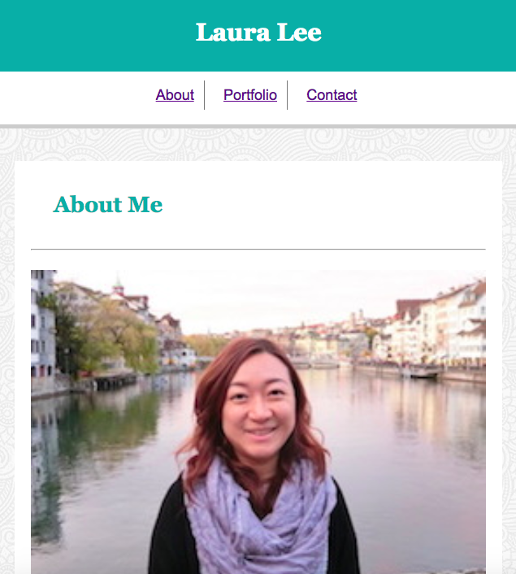

# Responsive-Portfolio
Assignment_Responsive-Portfolio


# Link to deployed site
https://lalatw.github.io/Responsive-Portfolio/


# Images
 

# Technology used
* html
* css


# Code snippets


```
@media screen and (max-width: 768px) {

    h1 {
        margin-left: 20px;
    }


    .container {
        margin-left: 25px; 
        width: 715px;     
    }


}


```


# Learning points
* Apply Media Query in CSS to create responsive web pages at different breakpoints including 980px, 768px, and 640px.
* Adjust margin for better layout along with media query.


# Author 
[Shuhan Laura Lee](https://lalatw.github.io/Responsive-Portfolio/)


# License
Standard MIT License
